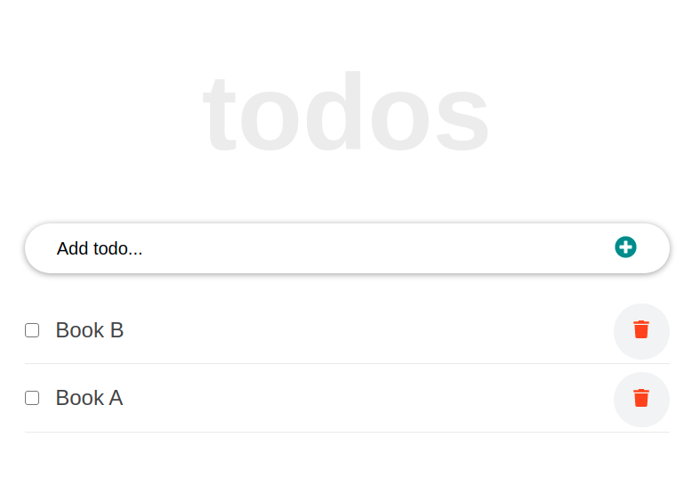

# TODO

This is a website created for the React tutorial

## Screenshot

## Built With

- React

## Live Demo

coming soon

## Getting Started

**This is an example of how you may give instructions on setting up your project locally.**
**Modify this file to match your project, remove sections that don't apply. For example: delete the testing section if the currect project doesn't require testing.**

To get a local copy up and running follow these simple example steps.

### Prerequisites
- Node.js
### Setup
- clone the Repo: https://github.com/RokoVarano/react-todo-app.git
### Install
- 
- In the cloned project folder, run 'npm run start'
### Usage
- Click on the button at the top left to diplay the header
- Click in home to go to the list
- Click About to see the About page
- Write a comment in the input box and hit 'Enter' to create a new list item
- Click the Delete button to delete an item

### Run tests
- No tests yet
## Authors

👤 **Rodrigo Ibaceta**

- GitHub: [Rodrigo Ibaceta](https://github.com/RokoVarano/)
- Twitter: [@Rodrigo](https://twitter.com/RodrigoIbacet11)
- LinkedIn: [LinkedIn](https://www.linkedin.com/in/rodrigo-ibaceta-a8657611a/)
## 🤝 Contributing

This code was done by following the instructions in the [React Tutorial from Scratch Guide](https://ibaslogic.com/react-tutorial-for-beginners/)

## Show your support

Give a ⭐️ if you like this project!

## Acknowledgments

- Hat tip to anyone whose code was used
- Inspiration
- etc

## 📝 License

This project is [MIT](https://opensource.org/licenses/MIT) licensed.